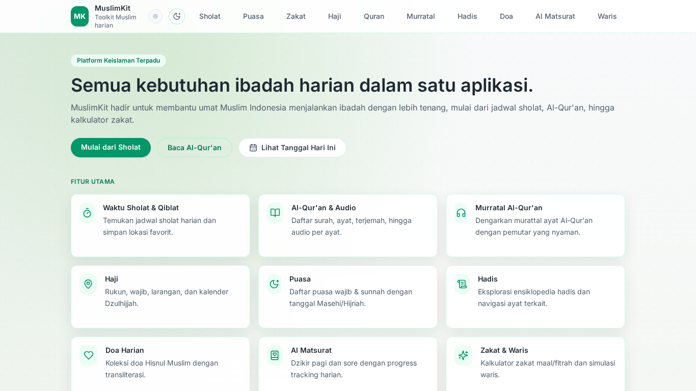
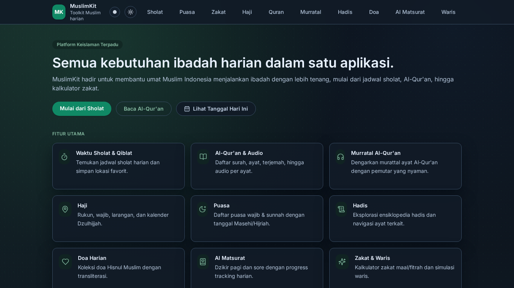
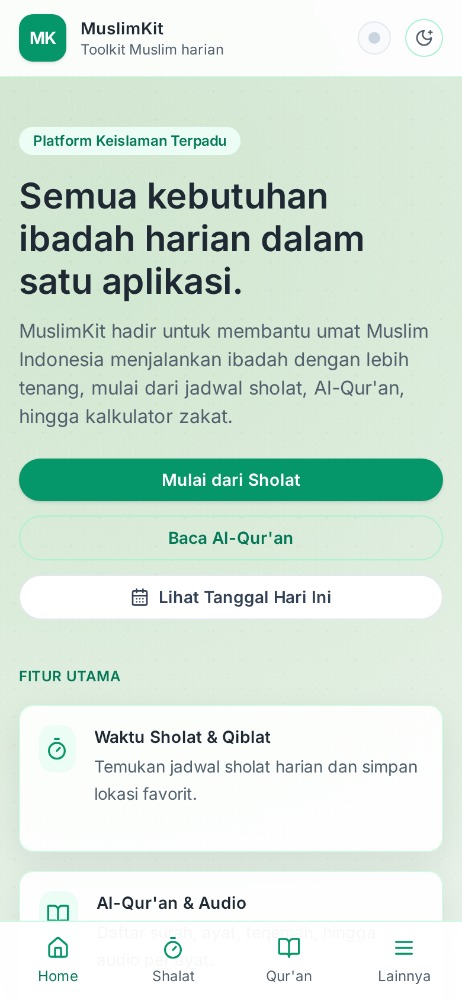
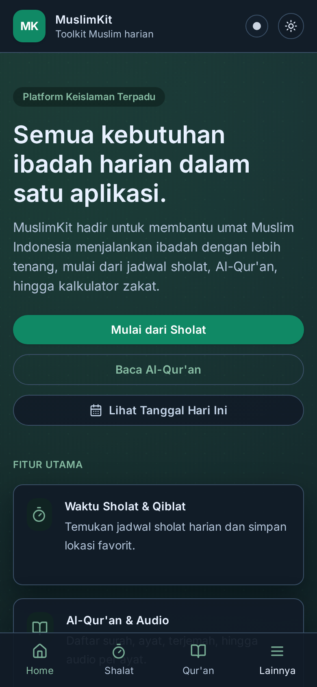

# MuslimKit

Repository ini berisi aplikasi MuslimKit (frontend web + API proxy) untuk kebutuhan ibadah harian.

## Preview

Lihat Full Tampilan di sini: [https://muslimkit.aantriono.com/](https://muslimkit.aantriono.com/)

### Desktop View

| Mode Terang | Mode Gelap |
| --- | --- |
|  |  |

### Mobile View

| Mode Terang | Mode Gelap |
| --- | --- |
|  |  |

## Dokumentasi

- Dokumentasi lengkap: [`DOKUMENTASI_LENGKAP.md`](DOKUMENTASI_LENGKAP.md)
- Frontend web: [`web/README.md`](web/README.md)
- API proxy: [`apimuslim-proxy/README.md`](apimuslim-proxy/README.md)
- API users (opsional): [`api/README.md`](api/README.md)

## Quick Start (Lokal)

Prasyarat:

- Bun
- Node.js + npm

1. Jalankan API proxy (`apimuslim-proxy`) di port `3002`:

```bash
cd /home/aantriono/Code/muslim/apimuslim-proxy
bun install
bun run dev
```

2. Jalankan frontend (`web`) di port `5173`:

```bash
cd /home/aantriono/Code/muslim/web
npm install
npm run dev
```

3. Buka aplikasi:

```txt
http://localhost:5173
```

4. Opsional: jalankan API users terpisah (`http://localhost:4001/api`):

```bash
cd /home/aantriono/Code/muslim/api
bun install
bun run dev
```

## Audit Menyeluruh

Jalankan audit penuh lintas service:

```bash
./audit
```

Audit ini dipakai juga oleh GitHub Actions (`Audit CI`) untuk PR/push.

## Deploy

Panduan deploy Cloudflare Pages ada di [`web/README.md`](web/README.md).
